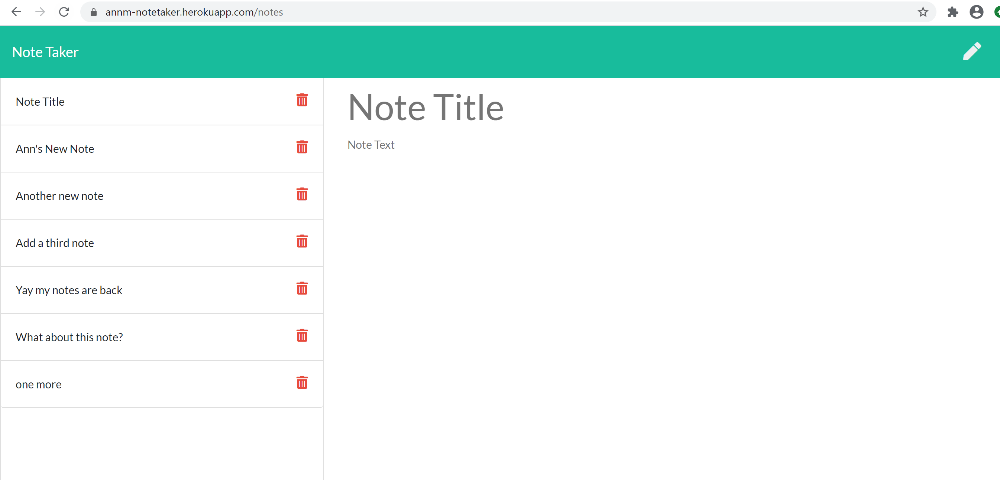
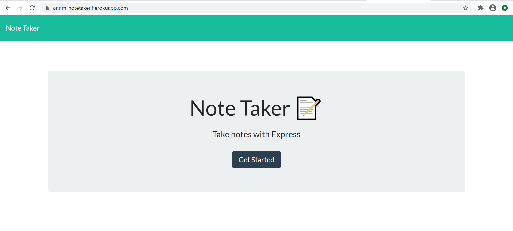

# Project Title: Note-Taker

## Description An application for writing and saving notes.

## Table of Contents:

1. [Installation] (#installation)
1. [Usage](#usage)
1. [Credits](#credits)
1. [License](#license)
1. [Tests](#tests)
1. [Questions](#questions)

## Installation Clone Repo. Install node.js and npm express, & uuidv4. Deploy to location that supports node.js and express.

## Usage Note-Taker is deployed here: https://annm-notetaker.herokuapp.com/

Screenshots: 
Screenshots: 

### click on "Get Started" Button

### Type in Note Title and Note Text, then click the save icon to save the note.

### To open saved notes, click on the Note Title on the left side of the page. The selected note will appear on the right.

### To delted saved note, click on the trash can icon.

### Clicking on "Note Taker" in the nav bar will take you back to the "Get Started" landing page.

## License mit

### License Link "https://choosealicense.com/licenses/mit",

## Questions

For more information about this or other projects check out my GitHub page or send me an email.

### GitHub Page AnnMarkham

### Email Address ann.markham@outlook.com
